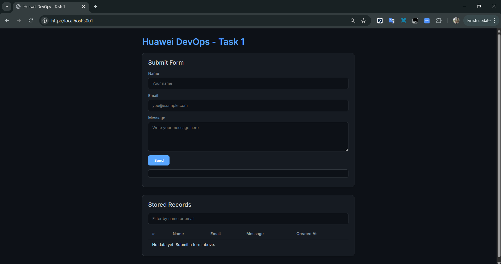

# DevOps Test Huawei - Task 1 Pengembangan Backend

## Description 
A simple web application with a frontend form and a backend API with these requirements:
- store and retrieve form submissions that can receive form data from the frontend.
- store it in simple data storage, such as an array within the server.
- ensure that the server can return the stored data when requested by the frontend.

## Folder Structure

- `frontend/`: Contains the frontend code.
- `backend/`: Contains the backend code.

## Tools

#### Frontend

- HTML
- CSS
- JavaScript
- lite-server

#### Backend

- Node.js
- Express.js
- cors

## How to Run


#### Use git to clone this project and navigate to the cloned directory
```
git clone https://github.com/aqilsulthan/huawei-devops-task-1
cd huawei-devops-task-1
```

#### Backend Setup

1.  Navigate to the `backend` directory:
    ```
    cd backend
    ```
2.  Install the dependencies:
    ```
    npm install
    ```
3.  Start the backend server:
    ```
    npm start
    ```
    The server will be running on `http://localhost:3000`.

#### Frontend Setup

1.  Navigate to the `frontend` directory:
    ```
    cd frontend
    ```
2.  Install the dependencies:
    ```
    npm install
    ```
3.  Start the frontend development server:
    ```
    npm start
    ```
    The application will be accessible at `http://localhost:5173`.

## API Endpoints

#### `POST /form`

Submits a new form entry.

**Request Body:**

```json
{
  "name": "Fabrizio Romano",
  "email": "fabrizio.romano@example.com",
  "message": "Hello, this is a test message, here we go!."
}
```

**Response:**

```json
{
    "ok": true,
    "data": {
        "name": "Fabrizio Romano",
        "email": "fabrizio.romano@example.com",
        "message": "Hello, this is a test message, here we go!.",
        "createdAt": "2025-09-15T06:20:34.230Z"
    }
}
```

### `GET /form`

Retrieves form entries. This endpoint can be used to get all entries or to search for specific entries.

**Query Parameters:**

- `search`: Filters entries by name or email. Returns all entries if not provided.

**Example Usage:**

- To get all entries: `GET /form`
- To search for entries with "fabrizio" in the name or email: `GET /form?search=fabrizio`

**Response:**

```json
{
  "ok": true,
  "count": 1,
  "data": [
    {
            "name": "Fabrizio Romano",
            "email": "fabrizio.romano@example.com",
            "message": "Hello, this is a test message, here we go!.",
            "createdAt": "2025-09-15T06:20:34.230Z"
        }
  ]
}
```

## API Documentation (Postman)

API Documentation can be accessed with this link: [API Docs](https://documenter.getpostman.com/view/24770514/2sB3HqGxxk)

## Frontend Interface
